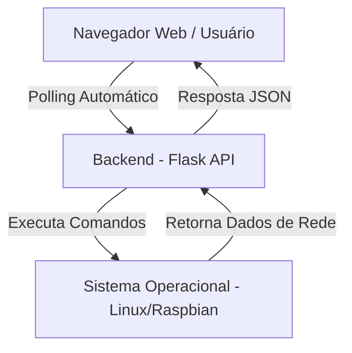
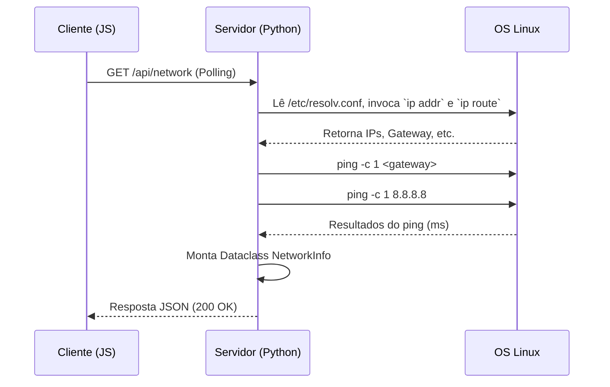

# Technical Specification (TechSpec) - Monitor de Rede Raspberry Pi

## 1. Arquitetura Geral
A solução utilizará uma arquitetura cliente-servidor leve, operando nativamente na Raspberry Pi.
- **Back-end:** Python 3.12+ utilizando `Flask` (leve e confiável) para a API e servimento dos arquivos estáticos.
- **Front-end:** HTML, CSS e Vanilla JavaScript. Utilizaremos CSS moderno (Glassmorphism, CSS Grid/Flexbox) para garantir um visual "premium".
- **Integração com SO:** O back-end fará chamadas ao sistema operacional Linux (Raspberry Pi OS) via biblioteca nativa `subprocess` e `socket` para coletar dados reais.

### Diagrama de Arquitetura



## 2. Modelagem de Dados
Seguindo as regras do *Spec-Driven Development*, utilizaremos `dataclasses` nativas do Python com tipagem estrita para estruturar a comunicação.

```python
from dataclasses import dataclass
from typing import List, Optional

@dataclass
class PingResult:
    destination: str
    name: str # Ex: "Gateway", "Serviço Externo"
    status: str # "Sucesso", "Atenção", "Falha"
    response_time_ms: Optional[float]
    timestamp: str

@dataclass
class NetworkInfo:
    hostname: str
    interface: str
    connection_state: str
    ip_address: str
    netmask: str
    gateway: str
    dns_servers: List[str]
    last_check_time: str
    ping_results: List[PingResult]
```

## 3. Endpoints da API (Back-end)
A aplicação exporá apenas as rotas essenciais para funcionamento:

- **`GET /`**: Retorna o arquivo `index.html` (Interface do Usuário).
- **`GET /api/network`**: Endpoint principal. Quando chamado, o servidor executa os testes de ping em tempo real, obtém as informações da rede e retorna o objeto `NetworkInfo` serializado em JSON.

### Fluxo do Endpoint de Rede


## 4. Estratégias de Coleta (Comandos de SO)
- **Hostname:** Obtido nativamente via módulo Python `socket.gethostname()`.
- **Interface, Gateway, IP e Máscara:** Parsing da saída do comando `ip -4 route show default` para identificar a interface principal e o gateway. E `ip -4 addr show <interface>` para o IP local e máscara.
- **Estado da Conexão:** Leitura do arquivo do sistema de arquivos virtual em `/sys/class/net/<interface>/operstate`.
- **DNS:** Leitura nativa do arquivo `/etc/resolv.conf`.
- **Ping:** Chamada do comando de sistema `ping -c 1 -W 2 <ip_destino>` via `subprocess.run()`. O parsing da saída padrão buscará o valor do campo `time=... ms`.

## 5. Lógica de UI e Polling
- **Tecnologia:** `fetch()` API nativa em JavaScript.
- **Polling:** Uma função `setInterval` configurada para disparar uma requisição ao endpoint `/api/network` a cada X segundos (ex: 5 a 10 segundos).
- **Regras Visuais:**
  - Tempo de resposta < 50ms: Verde (Sucesso).
  - Tempo de resposta >= 50ms (ou perda de pacote pacial): Amarelo (Atenção).
  - Destino inalcançável (Timeout): Vermelho (Falha).

---
**Aprovação Necessária:**
Mestre, a especificação técnica está pronta para revisão. A arquitetura e os dados foram elaborados para garantir leveza e robustez. Você **aprova** este documento para irmos para a fase de quebra em **Tasks**?
